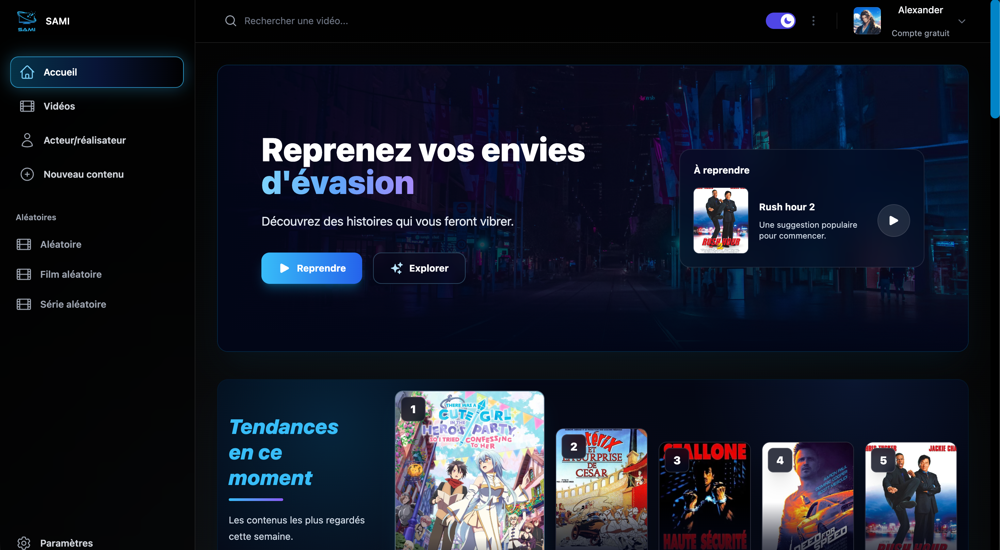
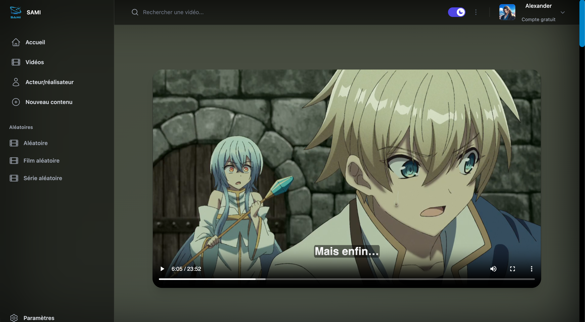
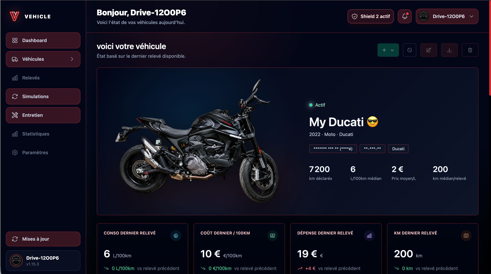
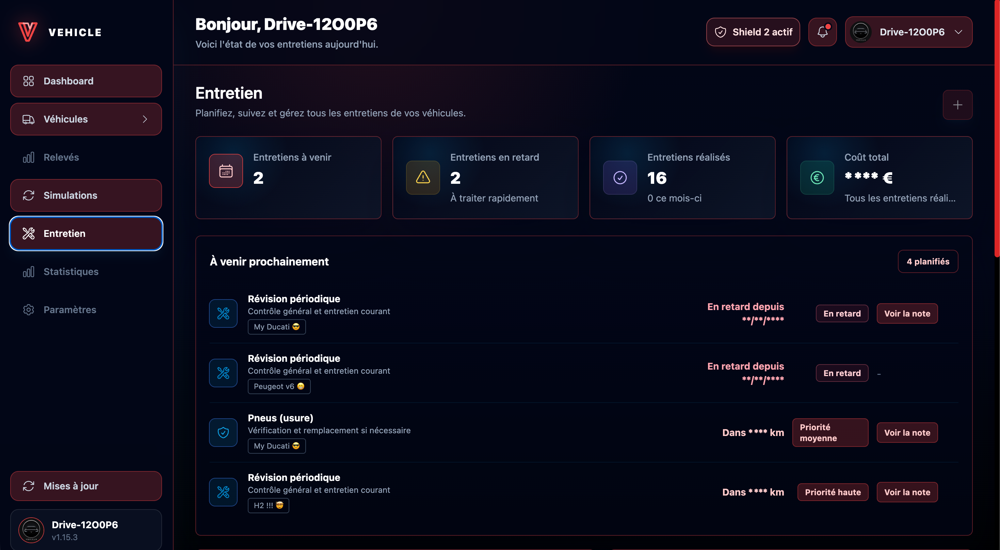

<h1 align="center">👋 Salut, moi c'est Alexander</h1>

<h3 align="center">
FullStack Developer • Self-Hosted Infrastructure • Linux Enthusiast
</h3>

Je conçois, développe et héberge mes propres applications web.
 
Passionné par l'automatisation, les architectures robustes et les projets long terme.

---

## 🚀 Projets principaux

### 🎬 SAMI
Serveur multimédia personnel.

- Node.js
- React
- Prisma
- MySQL
- FFmpeg
- HLS Streaming

---

### 🚗 Vehicle

Gestionnaire de véhicules et d'entretien.

- React
- Fastify
- Prisma
- MySQL
- JWT
- Upload sécurisé

---

### 📚 DoCode

Base de connaissances personnelle.

- Next.js
- Markdown
- Documentation technique
- Organisation des connaissances

---

### 🏗️ Ce qui m'intéresse

- Développement FullStack
- Linux & Self-Hosting
- Automatisation
- Bases de données
- Architecture logicielle
- Intelligence Artificielle
- Homelab

---

## 📊 GitHub Stats

---

## 🛠️ Stack principale

---

## ⚙️ Infrastructure

---

## 🎯 Objectif actuel

Construire un écosystème d'applications auto-hébergées :

SAMI • Vehicle • DoCode • SamiHub

avec une infrastructure fiable, évolutive et indépendante.

---
